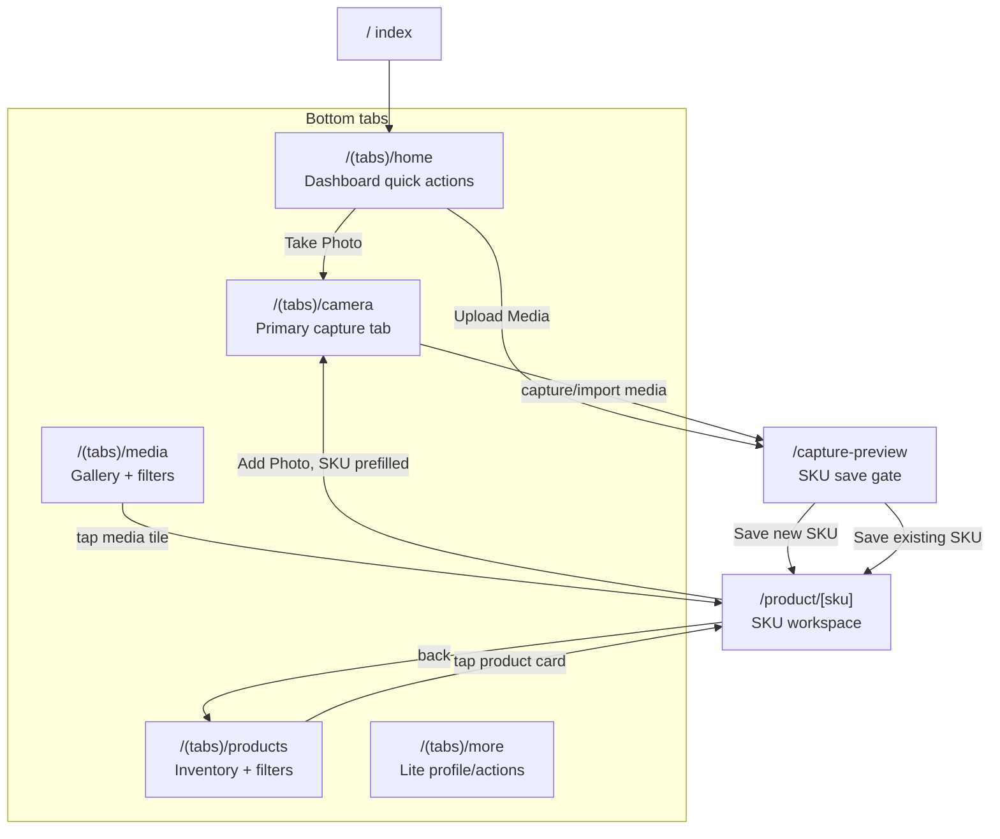
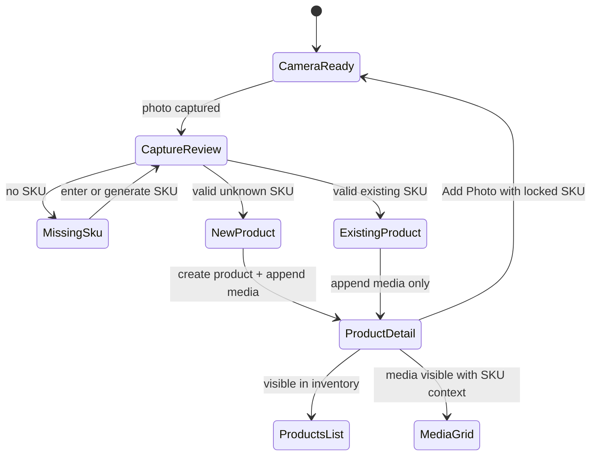
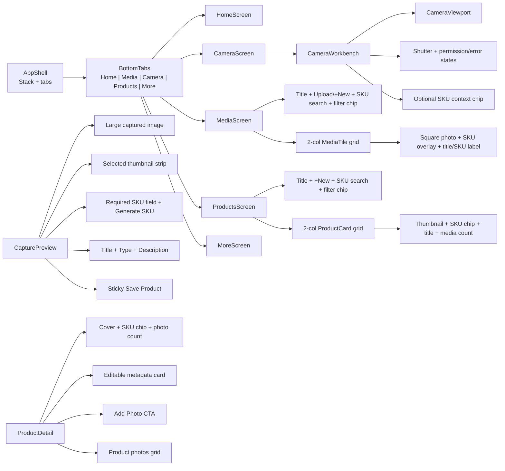
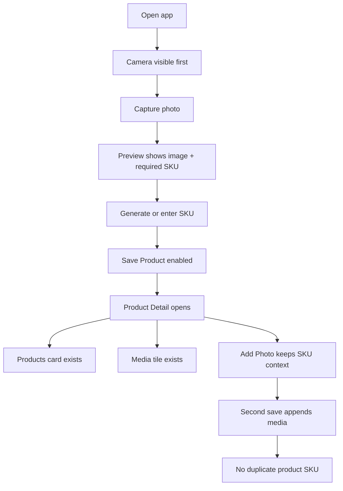

# GemHub Lite UI Graph

Purpose: AI-agent replacement map for app UI. Use screenshots + current code + theme. Build Lite UI from this graph, not full production clone.

## Source Evidence

- Real app research: `docs/research/GemHubApp.md`
- Screenshot set: `docs/research/screenshots/`
- Main creation set: `docs/research/screenshots/main-creation/`
- Current design contract: `DESIGN.md`
- Current routes: `app/_layout.tsx`, `app/(tabs)/_layout.tsx`
- Theme tokens: `src/theme/tokens.ts`

## Scope Rule

Keep: Home quick actions, Media, raised Camera, Products, More, Camera -> SKU gate -> Product Detail -> Products + Media sync, local image/video import, and Product/Media filters.
Drop: auth, cloud sync, credits, billing, hardware controls, editor/AI studio, Shopify, production assets/copy, and other network-backed production systems.

## Global Navigation Graph

## Product-State Graph

## Screen Node Map

| Node | Route | Current Components | Screenshot References | Replacement Target |
| --- | --- | --- | --- | --- |
| Home | `/(tabs)/home` | `Screen`, quick actions, metrics, `ProductCard` recents | `01-home.png` | Lite dashboard: Take Photo, Upload Media, Products, Collections placeholder, local metrics, recents |
| Camera | `/(tabs)/camera` | `Screen`, `GemHubCameraView` | `18-camera-screen.png`, `01-home.png` camera emphasis | Full-height camera/workbench, centered shutter, SKU-context banner only when launched from Product Detail |
| Capture Preview | `/capture-preview` | `CaptureReview`, `BottomSaveBar`, `Field`, `Picker`, `ActionSheet` | `03-capture-product-info.png`, `09-new-sku-product-form.png`, `14-filled-product-form.png`, `main-creation/01-after-capture-creating-product.png` | Large image, thumbnail strip, required SKU, generate SKU, title/type/description, sticky Save Product |
| Product Type Sheet | modal from Capture Preview/Product Detail | `ActionSheet` | `11-product-type-menu.png`, `12-product-type-selected.png`, `13-ring-type-selected.png`, `main-creation/04-select-product-type.png`, `main-creation/05-sub-menu-select-type.png` | Lite flat picker only: Ring, Necklace, Earring, Bracelet, Pendant, Other |
| Product Detail | `/product/[sku]` | `ProductHeader`, `ProductFormSection`, `AddPhotoButton`, `MediaGrid` | inferred from capture flow; product detail not fully observed | SKU-centered workspace: cover, locked SKU chip, editable metadata, Add Photo, photo grid |
| Products | `/(tabs)/products` | `ProductCard`, `EmptyStateCard`, `FlatList`, `FilterSheet` | `27-product-tab.png`, `07-sku-does-not-exist.png` for empty/create logic | Responsive cards: thumbnail/video cover, SKU chip, title fallback, media count, search/type/sort filters; empty state CTA |
| Media | `/(tabs)/media` | `MediaTile`, `EmptyStateCard`, `FlatList`, `FilterSheet` | `19-media-tab.png`, `20-select-media-in-media-tab.png`, `21-asign-SKU.png` | Responsive gallery: thumbnails/video placeholders, SKU overlay, product title context, search/type/date/sort filters; tap opens Product Detail |
| Empty State | Products/Media | `EmptyStateCard` | `27-product-tab.png`, `19-media-tab.png` | Calm card with one primary action; no tutorial video asset |
| Add Photo Flow | Product Detail -> Camera/Library -> Capture Preview | `AddPhotoButton`, `GemHubCameraView`, `CaptureReview` | `16-second-capture-blank-sku.png`, `17-second-capture-save-blank.png` | SKU must remain prefilled by context; save appends, no duplicate product |
| More | `/(tabs)/more` | grouped action rows | `01-home.png` bottom nav More | Lite profile/action hub; no auth/cloud implementation |

## Replacement UI Tree

## Theme Contract

Use current tokens exactly unless replacing design system globally.

| Token | Value | Use |
| --- | --- | --- |
| `background` | `#F7FAFA` | App canvas |
| `surface` | `#FFFFFF` | Cards, tab bar, sheets |
| `surfaceMuted` | `#F2F5F5` | Inputs, placeholders, camera panels |
| `accent` | `#18B8B8` | Primary CTA, active camera, SKU chips |
| `accentDark` | `#079999` | Active tab / pressed accent |
| `border` | `#E5ECEC` | Dividers, input/card borders |
| `text` | `#111827` | Primary text |
| `secondaryText` | `#6B7280` | Metadata/help text |
| `radius.lg` | `16` | Cards |
| `radius.xl` | `24` | Large image/sheets |
| `radius.pill` | `999` | Chips, camera button |
| `spacing.md` | `16` | Default screen rhythm |
| `screenTitle` | `22/28/700` | Screen titles |
| `sku` | `12/16/700` | SKU chips |

## Core Component Specs

### AppShell

- Stack routes: `index`, `(tabs)`, `capture-preview`, `product/[sku]`.
- Initial route redirects to `/(tabs)/camera`.
- Bottom tabs show Media, Camera, Products only.
- Camera tab is center, raised, teal, 58px circle.

### InventoryHeader

Needed but not fully built. Shared by Products/Media replacement.

- Row 1: screen title left, action right (`+ New`, `Upload`, or `Add`).
- Row 2: SKU search input, filter chip.
- Search/filter can be visual-only if filtering not implemented yet; do not block core flow.

### CaptureReview

- Large square image top.
- Thumbnail strip under image.
- SKU required. Normalize uppercase. Invalid blocks Save.
- Generate SKU uses existing repo pattern: `SKU-YYYYMMDD-###`.
- Metadata fields optional: Title, Product type, Description.
- Sticky bottom Save Product full-width.
- Save new SKU creates product + media; save existing SKU appends media.
- Success route: `router.replace('/product/[sku]')`.

### ProductCard

- Pressable full card.
- Thumbnail top, rounded.
- SKU chip accent.
- Title if present, else `No title` tertiary.
- Media count metadata.
- Tap opens `/product/[sku]`.

### MediaTile

- Square thumbnail.
- SKU chip overlay top-left.
- Product title below; fallback SKU.
- Tap opens owning Product Detail.
- No unassigned media state.

### ProductDetail

- Header card: cover thumbnail, SKU chip, `Product Detail`, photo count.
- Details card: Title, Product type, Description, Save changes.
- Add Photo CTA routes to camera with `sku` param.
- Media grid shows product photos.
- SKU locked after creation; never editable in detail.

## Screenshot-to-Implementation Mapping

| Screenshot | Use | Do Not Copy |
| --- | --- | --- |
| `01-home.png` | Camera prominence, bottom nav hierarchy | Home dashboard, profile/credits |
| `03-capture-product-info.png` | Capture preview rhythm, image + form + save | Exact copy/assets/AI labels |
| `06-choose-sku-loading.png` | SKU selection/loading state idea | Production account data |
| `07-sku-does-not-exist.png` | Unknown SKU empty/create path | Exact wording |
| `09-new-sku-product-form.png` | Product create form structure | Advanced fields not in Lite |
| `11-product-type-menu.png` | Picker hierarchy inspiration | Full taxonomy if time tight |
| `19-media-tab.png` | Media header/gallery density | Video/editor/cloud controls |
| `21-asign-SKU.png` | SKU association concept | Misspelled/production-specific copy |
| `23-filter-dropdown.png` | Filter chip/sheet pattern | Complex filters before core passes |
| `27-product-tab.png` | Product grid/card shape | Tutorial video/production CTA copy |
| `28-home-tab.png` | Broad visual rhythm only | Home tab itself |
| `29-top-right-toolbar-action-nav-to-profile.png` | Top action placement only | Profile/account surfaces |
| `31-click-on-new-collection.png` | Ignore for v1 | Collections |
| `33-create-automate-collection-based-on-filter.png` | Ignore for v1 | Automation/filter-builder |
| `main-creation/01-after-capture-creating-product.png` | Post-capture create flow | Production-only extras |
| `main-creation/06-specification-pricing-inventory-input.png` | Backlog fields reference | Pricing/inventory v1 scope |
| `main-creation/08-jewelry-details-extra-not-needed.png` | Explicit out-of-scope proof | Jewelry appraisal fields |
| `main-creation/09-main-stone-detail-extra-not-needed.png` | Explicit out-of-scope proof | Stone detail forms |

## Agent Build Order

1. Preserve routes and data invariants.
2. Replace shared visual primitives only if needed: `Screen`, `Card`, `Button`, `Field`, `Picker`, `Thumbnail`, `Chip`.
3. Build `InventoryHeader` and use in Products/Media.
4. Rework Camera screen into capture-first workbench.
5. Rework Capture Preview from screenshot map.
6. Rework Products and Media grids.
7. Rework Product Detail as SKU workspace.
8. Validate required flows on iOS and Android if available.

## Acceptance Graph

## Non-Negotiables

- No saved media without SKU.
- Existing SKU appends media; no duplicate product rows.
- Product and Media lists refresh on focus.
- Product Detail is reachable from Products and Media.
- SKU immutable after product creation.
- Empty states always offer route back to capture/add.
- UI stays neutral white/teal, rounded, compact, merchant-workflow focused.
